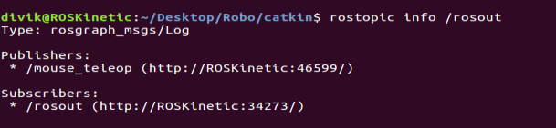
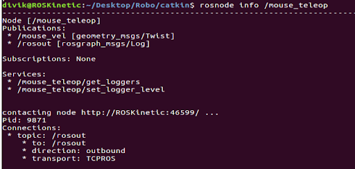

# Streamlined Mouse Control for Kobuki Robots

## Table of Contents

- [Introduction](#introduction)
- [Operating System](#operating-system)
- [Topics and Message Types](#topics-and-message-types)
- [Usage](#usage)
- [Testing](#testing)
- [Possible Improvements](#possible-improvements)
- [License](#license)
- [Contributing](#contributing)
- [Acknowledgments](#acknowledgments)

## Introduction
This project enables the control of the Kobuki robot using a mouse, providing a more intuitive and accessible method compared to traditional keyboard inputs. The system is designed to run on ROS (Robot Operating System), leveraging existing tools and libraries for efficient robot management. This approach not only simplifies the user interaction but also enhances the flexibility of robot control in various environments. Ideal for educational purposes, the project offers hands-on experience with real-time robot control systems, suitable for both beginners and advanced users with a basic setup of ROS and compatible hardware.

## Operating System
This project is tested on Ubuntu v16.04 (kinetic).

## Topics and Message Types

To determine the topic name and message type for the mouse teleop node, follow these steps:

1. List all ROS topics by running:
    ```bash
    rostopic list
    ```
    Example:
   
    
2. To Identify the publication and subscription of a node:
   ```bash
   rosnode info <node_name>
   ```
   Example:
   
    
    
## Usage

Set up and control the Kobuki robot using the following steps across multiple terminals:

### Terminal 1:
Start ROS core:
```bash
roscore
```

### Terminal 2:
Launch the minimal setup for TurtleBot. A beep sound indicates a successful connection:
```bash
roslaunch turtlebot_bringup minimal.launch
```

### Terminal 3:
Run the mouse teleop tool:
1. Navigate to the `teleop_tools` directory.
2. Source the ROS workspace:
   ```bash
   source devel/setup.bash
   ```
3. Launch the mouse teleop:
   ```bash
   roslaunch mouse_teleop mouse_teleop.launch
   ```
This command opens a GUI to control the robot via mouse. Hold and drag the left mouse button to move the Kobuki.

### Terminal 4:
Connect the mouse teleop node to the robot:
1. Navigate to the `mouse_teleop_runner` directory.
2. Source the ROS workspace:
   ```bash
   source devel/setup.bash
   ```
3. Execute the mouse teleop interceptor:
   ```bash
   rosrun mouse_teleop_interceptor mouse_teleop_interceptor
   ```

## Testing

If the setup does not work, consider the following tests:
- Ensure the virtual machine has access to connected devices if used.
- Test robot connectivity with keyboard teleop to verify setup:
   ```bash
   roslaunch turtlebot_teleop keyboard_teleop.launch
   ```

## Possible Improvements

Several enhancements could be integrated into the mouse teleop system for the Kobuki robot to optimize its performance and user experience:

- **Autonomous Environmental Detection:** Implementing sensors and algorithms that allow the robot to detect its environment autonomously could enhance navigation. This feature would enable the Kobuki to make informed decisions about when to move forward or adjust its path, reducing the need for constant manual control and improving its ability to operate in complex environments.

- **Smoother Braking System:** Enhancing the braking mechanism to achieve smoother stops can greatly improve the handling and safety of the robot. This improvement could involve refining the software algorithms that control the motor's speed and braking response, or upgrading the hardware components related to the braking system.

- **Continuous Movement Control:** Modifying the control logic to allow continuous movement of the robot as long as the mouse button is pressed could provide a more intuitive control experience. Currently, the robot stops once the mouse button is released; however, having it continue to move until explicitly instructed to stop would mimic more natural movement controls found in other types of vehicles or gaming controls.

## License

This project is licensed under the MIT License - see the [LICENSE](LICENSE) file for details.

## Contributing

Contributions are welcome! For major changes, please open an issue first to discuss what you would like to change. Please ensure to update tests as appropriate.

## Acknowledgments

Special thanks to the course instructors who provided the materials and support necessary for this project.
